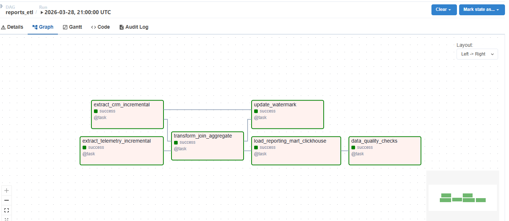
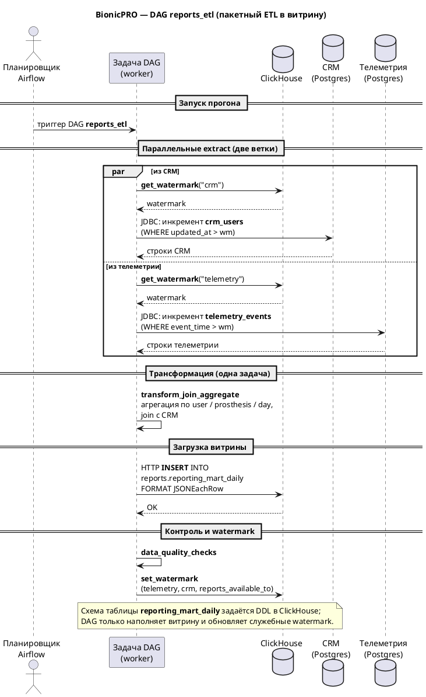

# BionicPRO — локальный стенд

Монорепозиторий с фронтом, **bionicpro-auth** (OIDC/PKCE, cookie-сессия в Redis), **reports-api** (отчёты из ClickHouse, кэш CSV в MinIO, раздача через CDN-nginx), **Keycloak**, OLTP (CRM, телеметрия), **Airflow** (ETL витрины), **Kafka/Debezium** (CDC в ClickHouse).

## Требования

- [Docker](https://docs.docker.com/get-docker/) и Docker Compose v2
- Порты на хосте **свободны**: 3000, 389, 5433–5437, 6379, 8000, 8001, 8080, 8081, 8088, 8123, 9000, 9002, 9003, 9092–9093

## Запуск

```bash
cd architecture-bionicpro
docker compose up -d
```

Первый старт может занять несколько минут (Keycloak, Airflow, инициализация MinIO и т.д.).

Пересборка образов после правок кода:

```bash
docker compose build
docker compose up -d
```

Остановка:

```bash
docker compose down
```

## Сервисы и URL

| Назначение | URL |
|------------|-----|
| Фронтенд | http://localhost:3000 |
| bionicpro-auth | http://localhost:8000 |
| reports-api | http://localhost:8001 |
| Keycloak | http://localhost:8080 |
| Airflow UI | http://localhost:8081 |
| CDN (кэш отчётов поверх MinIO) | http://localhost:8088 |
| MinIO API | http://localhost:9002 |
| MinIO Console | http://localhost:9003 |
| ClickHouse HTTP | http://localhost:8123 |
| Kafka Connect | http://localhost:8083 |

Отдельно: PostgreSQL для Keycloak, CRM, телеметрии, профилей, Airflow — см. `docker-compose.yaml` (порты 5433–5437).

## Учётные записи

### Keycloak

- **Админ-консоль** (`/admin/master/...`): логин `admin`, пароль `admin` (realm **master**).
- **Realm `reports-realm`** (вход в приложение): тестовые пользователи заданы в `keycloak/realm-export.json`, например:
  - `user1` / `password123` (email `user1@example.com`)
  - `admin1` / `admin123`
  - пользователи `prothetic*` / `prothetic123`

В админку Keycloak заходить учёткой **admin**, не `user1`.

### Airflow

- http://localhost:8081 — `admin` / `admin`

**Подключения для DAG `reports_etl`** (CRM, телеметрия, ClickHouse по HTTP) задаются в файле [`airflow/reports-etl.env`](airflow/reports-etl.env): переменные `CRM_DSN`, `TELEMETRY_DSN`, `CLICKHOUSE_HTTP`. Шаблон с теми же ключами — [`airflow/reports-etl.example.env`](airflow/reports-etl.example.env) (удобно скопировать в `reports-etl.env` при первой настройке). В `docker-compose.yaml` `reports-etl.env` подключён как `env_file` у сервисов `airflow-webserver` и `airflow-scheduler`, чтобы строки подключения не дублировались в коде DAG.

Для локальных переопределений (например, другие пароли) можно завести **`airflow/reports-etl.local.env`** с теми же именами переменных и добавить второй `env_file` в compose; файл `*.local.env` в репозиторий не коммитится (см. `.gitignore`).

### MinIO (консоль)

- Пользователь `minioadmin`, пароль `minioadmin123` (как в compose; для S3 в приложениях заданы через env).

## Минимальная проверка после запуска

```bash
docker compose ps
```

Ожидайте статус **Up** у нужных контейнеров. У одноразовых задач (например `minio-init`) статус **Exited 0** — норма.

```bash
curl -s http://localhost:8000/health
curl -s http://localhost:8001/health
```

Ожидается JSON с `"ok": true`.

## Airflow: пример успешного `reports_etl`

В UI (http://localhost:8081) откройте DAG **`reports_etl`** → вкладка **Graph**. При нормальном завершении прогона все задачи в **success** (зелёная обводка), как на скриншоте:



Sequence-диаграмма
Исходник: [`docs/reports-etl-sequence.puml`](docs/reports-etl-sequence.puml).



Цепочка: параллельно **`extract_crm_incremental`** и **`extract_telemetry_incremental`** → **`transform_join_aggregate`** → **`load_reporting_mart_clickhouse`** и **`update_watermark`** → **`data_quality_checks`**.

## Итоговая проверка: скачивание отчёта и кэш

1. Убедитесь, что витрина в ClickHouse заполнена: в Airflow (http://localhost:8081) DAG `reports_etl` успешно отработал хотя бы раз. Иначе отчёт будет пустым — см. **[troubleshooting.md](troubleshooting.md)**.
2. Откройте http://localhost:3000, нажмите **Login** и войдите, например как `user1` / `password123` (realm `reports-realm`).
3. На странице отчёта нажмите скачивание CSV (кнопка получения отчёта). После ответа **reports-api** под строкой со статусом появится подпись **`cache: miss`** — объект в MinIO создан, CSV собран из ClickHouse.
4. Нажмите скачивание **ещё раз** с теми же параметрами периода (без смены пользователя). Должно отобразиться **`cache: hit`** — файл уже есть в S3, повторной выгрузки из ClickHouse нет.

Так проверяется цепочка: OIDC → сессия → фильтр по пользователю → при необходимости генерация CSV и загрузка в MinIO → раздача через CDN; повторный запрос идёт по кэш-ключу в бакете.

Сценарии при сбоях и пустых отчётах — **[troubleshooting.md](troubleshooting.md)**.

## Локальная разработка без полного compose

Отдельные сервисы можно гонять через `npm start` / `node`, но понадобятся Redis, Keycloak, БД и переменные окружения — проще опираться на compose.

## Дополнительно

- Схемы ClickHouse: `clickhouse/init/`
- DAG ETL: `airflow/dags/reports_etl.py`; переменные окружения — `airflow/reports-etl.env`, шаблон — `airflow/reports-etl.example.env` (см. раздел Airflow выше)
- Юнит-тесты HTTP-клиента ClickHouse (без Docker): см. **[tests/README.md](tests/README.md)** (`pip install -r airflow/requirements-dev.txt`, затем `pytest`).
- Документация по спринту — в репозитории курса (`docs/` родительского проекта).
